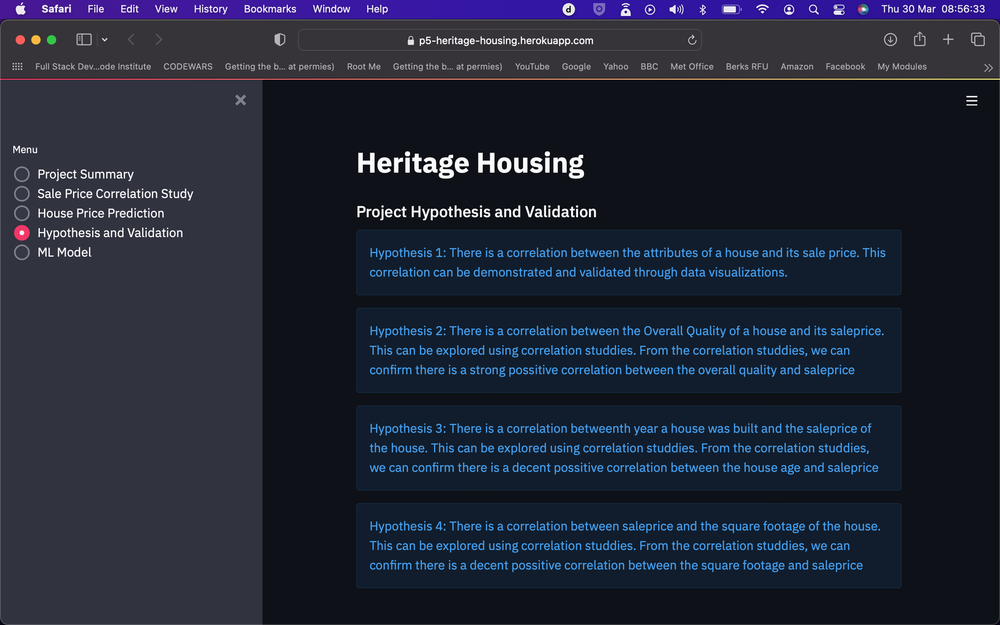

# Heritage Housing Issues

This is a Machine Learning project, where i will provide a app which uses python, to perform  Data Analysis and Data Visualization, to be shown on a Streamlit powered front end. This is my final project as a student of the code instute.

## Click [here](https://p5-heritage-housing.herokuapp.com) to live site.

## Dataset Content
* The dataset is sourced from [Kaggle](https://www.kaggle.com/codeinstitute/housing-prices-data). We then created a fictitious user story where predictive analytics can be applied in a real project in the workplace. 
* The dataset has almost 1.5 thousand rows and represents housing records from Ames, Iowa, indicating house profile (Floor Area, Basement, Garage, Kitchen, Lot, Porch, Wood Deck, Year Built) and its respective sale price for houses built between 1872 and 2010.

|Variable|Meaning|Units|
|:----|:----|:----|
|1stFlrSF|First Floor square feet|334 - 4692|
|2ndFlrSF|Second-floor square feet|0 - 2065|
|BedroomAbvGr|Bedrooms above grade (does NOT include basement bedrooms)|0 - 8|
|BsmtExposure|Refers to walkout or garden level walls|Gd: Good Exposure; Av: Average Exposure; Mn: Minimum Exposure; No: No Exposure; None: No Basement|
|BsmtFinType1|Rating of basement finished area|GLQ: Good Living Quarters; ALQ: Average Living Quarters; BLQ: Below Average Living Quarters; Rec: Average Rec Room; LwQ: Low Quality; Unf: Unfinshed; None: No Basement|
|BsmtFinSF1|Type 1 finished square feet|0 - 5644|
|BsmtUnfSF|Unfinished square feet of basement area|0 - 2336|
|TotalBsmtSF|Total square feet of basement area|0 - 6110|
|GarageArea|Size of garage in square feet|0 - 1418|
|GarageFinish|Interior finish of the garage|Fin: Finished; RFn: Rough Finished; Unf: Unfinished; None: No Garage|
|GarageYrBlt|Year garage was built|1900 - 2010|
|GrLivArea|Above grade (ground) living area square feet|334 - 5642|
|KitchenQual|Kitchen quality|Ex: Excellent; Gd: Good; TA: Typical/Average; Fa: Fair; Po: Poor|
|LotArea| Lot size in square feet|1300 - 215245|
|LotFrontage| Linear feet of street connected to property|21 - 313|
|MasVnrArea|Masonry veneer area in square feet|0 - 1600|
|EnclosedPorch|Enclosed porch area in square feet|0 - 286|
|OpenPorchSF|Open porch area in square feet|0 - 547|
|OverallCond|Rates the overall condition of the house|10: Very Excellent; 9: Excellent; 8: Very Good; 7: Good; 6: Above Average; 5: Average; 4: Below Average; 3: Fair; 2: Poor; 1: Very Poor|
|OverallQual|Rates the overall material and finish of the house|10: Very Excellent; 9: Excellent; 8: Very Good; 7: Good; 6: Above Average; 5: Average; 4: Below Average; 3: Fair; 2: Poor; 1: Very Poor|
|WoodDeckSF|Wood deck area in square feet|0 - 736|
|YearBuilt|Original construction date|1872 - 2010|
|YearRemodAdd|Remodel date (same as construction date if no remodelling or additions)|1950 - 2010|
|SalePrice|Sale Price|34900 - 755000|

## Business Requirements
As a good friend, you are requested by your friend, who has received an inheritance from a deceased great-grandfather located in Ames, Iowa, to  help in maximising the sales price for the inherited properties.

Although your friend has an excellent understanding of property prices in her own state and residential area, she fears that basing her estimates for property worth on her current knowledge might lead to inaccurate appraisals. What makes a house desirable and valuable where she comes from might not be the same in Ames, Iowa. She found a public dataset with house prices for Ames, Iowa, and will provide you with that.

* 1 - The client is interested in discovering how the house attributes correlate with the sale price. Therefore, the client expects data visualisations of the correlated variables against the sale price to show that.
* 2 - The client is interested in predicting the house sale price from her four inherited houses and any other house in Ames, Iowa.

## Hypothesis and how to validate?
* Hypothesis 1: There is a correlation between the attributes of a house and its sale price. This correlation can be demonstrated and validated through data visualizations.
* Hypothesis 2: There is a correlation between the Overall Quality of a house and its saleprice. This can be explored using correlation studdies.
* Hypothesis 3: There is a correlation betweenth year a house was built and the saleprice of the house. This can be explored using correlation studdies.
* Hypothesis 4: There is a correlation between saleprice and the square footage of the house.
This can be explored using correlation studdies.

## The rationale to map the business requirements to the Data Visualisations and ML tasks
* List your business requirements and a rationale to map them to the Data Visualisations and ML tasks.

* **Business Requirement 1:** Data Visualization and Correlation study
	* As a client, I will inspect the data related to the houses, so i can discover how the sales prices are linked to the different attributes
	* As a client, I will conduct a Pearson and Spearmans correlation study to understand how the attributes are correlated to the house sale price.
	* As a client, I will plot the main variables against sale price to visualize insights.

* **Business Requirement 2:** Regression and Data Analysis
	* As a client, I want to predict the house sale price from the four inherited houses and any other house in Ames, Iowa, using a machine learning model.
	* We want to build a regression model, where the target is the sale price.

## ML Business Case
### Predict Sales Price
#### Regression Model
* We want an ML model to predict the sales price, in pounds, for a house in Ames, Iowa. A target variable is a discrete number. We consider a **regression model**, which is supervised and uni-dimensional.
* Our ideal outcome is to provide clients with reliable insight into sales prices of houses with a higher sense of loyalty.
* The model success metrics are
	* At least 0.75 for R2 score, on train and test set
	* The ML model is considered a failure if:
		* the R2 score is below 0.75 on the train and test sets, and/or if the model's predictions are more than 50% off for 30% of inputs after 12 months of use. 

## User Stories

### Epic 1   Information Gathering and Data Collection
* User Story 1: As a coder, I want to identify and collect relevant data from the source, so that we have access to accurate and reliable data.

### Epic 2   Data Visualization, Cleaning, and Preparation
* User Story 2: As a coder, I want to clean and preprocess the data, so that it is fit for modeling.

* User Story 2: As a coder, I want to clean and preprocess the data, so that it is fit for modeling.

### Epic 3   Model Training, Optimization, and Validation 
* User Story 1: As a data scientist, I want to select and train a model that can accurately predict house prices based on the given data.

* User Story 2: As a coder, I want to optimize the model's hyperparameters to improve its accuracy and performance.

* User Story 3: As a coder, I want to validate the model's performance using a test dataset, so that we can ensure that it is generalizable to new data.

### Epic 4   Dashboard Planning, Designing, and Development
* User Story 1: As a coder, I want to plan and design a dashboard that can display the predicted house prices in a user-friendly way.

###  Epic 5  Dashboard Deployment and Release
* User Story 1: As a coder, I want to deploy the dashboard to a production environment, so that it can be accessed by end-users.

## Dashboard Design
### Page 1 - Quick Summary
* terms and jargon;
* information on the dataset; and
* the business/client requirements.

### Page 2 - Sale Price Study
This page answers the first buissness requirement:
* Shows dataset used.
* Ticking box, displays the variable compared to sales price on graph plot.
* Ticking box, displays Spearmanns Correlations
* Ticking box displys PPS and correlations

### Page 3 - House Price Prediction
This page answers the second buissness requirements:
* Able to input house attributes to produce a prediction on the sale price
* Show the value of the house predicted
* Display house data of friend that wishes to know there value
* Show the value of her houses

### Page 4  -  Hypothosis and Validation
* This page shows a breif description of the hyposis of this project

### Page 5  -  ML Model
* Shows this pipeline used
* Shows the most important features
* Shows pipeline performance

## Fixed Bugs
* There was a miss match between two of my pipelines in the modeling and evaluation notebook which caused an error.

## Unfixed Bugs
* Graph for feature importance wont save, therefore wont show up on the ML model page of my app.
* In Modeling and evuation notebook, my most important features have been selected wrong. GrLivArea has been missed off and replaced by a less important variable, kitchen quality. This was partially solved by hand coding in the most important vars into my pipeline in a later step, therefore writing over the "wrong" set of most important vars.

## Deployment
### Heroku

* The App live link is: https://p5-heritage-housing.herokuapp.com
* Set the runtime.txt Python version to a [Heroku-20](https://devcenter.heroku.com/articles/python-support#supported-runtimes) stack currently supported version.
* The project was deployed to Heroku using the following steps.

1. Log in to Heroku and create an App
2. At the Deploy tab, select GitHub as the deployment method.
3. Select your repository name and click Search. Once it is found, click Connect.
4. Select the branch you want to deploy, then click Deploy Branch.
5. The deployment process should happen smoothly if all deployment files are fully functional. Click the button Open App on the top of the page to access your App.
6. If the slug size is too large then add large files not required for the app to the .slugignore file.

## Main Data Analysis and Machine Learning Libraries

NumPy: Used for its matrix abilities
Pandas: Used for thier dataframes throughout the project
MatPlotLib: To visualize our data
Seaborn: To visualize our data
Streamlit: an app framework for ML dashboards. Used for the dashboarding for this project.
PPS Score: to detect linear or non-linear relationships between two columns. 
Feature Engine: select features to use in machine learning models and tranform

## Credits 

* The code institue for use for the chernomter project to base this project off, as well as the template for this project.

### Content 

- The text for the Home page was taken from Wikipedia Article A
- Instructions on how to implement form validation on the Sign-Up page was taken from [Specific YouTube Tutorial](https://www.youtube.com/)
- The icons in the footer were taken from [Font Awesome](https://fontawesome.com/)

